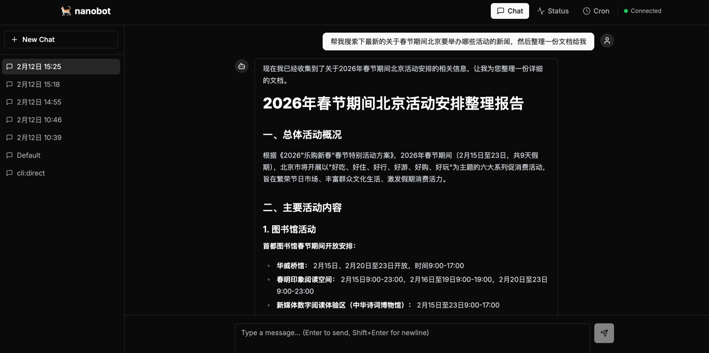
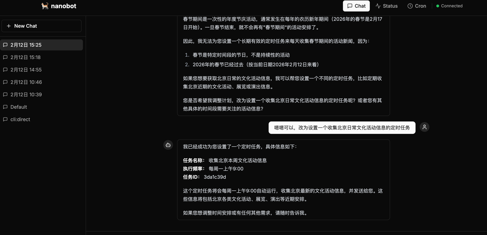
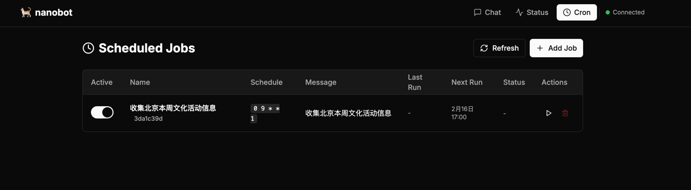

# 多租户Nanobot，包括Web端

轻量级个人 AI 助手框架，支持多平台渠道接入、工具调用、定时任务和 Web 实时通信。

---

## 目录

1. [快速开始](#1-快速开始)
2. [整体架构](#2-整体架构)
3. [Agent 系统](#3-agent-系统)
4. [工具系统](#4-工具系统)
5. [Provider 系统](#5-provider-系统)
6. [Session 系统](#6-session-系统)
7. [消息总线](#7-消息总线)
8. [Channel 系统](#8-channel-系统)
9. [Web Channel 与 WebSocket](#9-web-channel-与-websocket)
10. [Cron 与 Heartbeat](#10-cron-与-heartbeat)
11. [配置系统](#11-配置系统)
12. [CLI 命令](#12-cli-命令)
13. [前端](#13-前端)
14. [文件索引](#14-文件索引)

---

## 1. 快速开始

### 配置

编辑 `~/.nanobot/config.json`，只需配置模型和对应 provider 的 key：

```json
{
  "agents": {
    "defaults": {
      "model": "dashscope/qwen3-coder-plus"
    }
  },
  "providers": {
    "dashscope": {
      "apiKey": "sk-xxxx",
      "apiBase": "https://dashscope.aliyuncs.com/compatible-mode/v1"
    }
  }
}
```

### 测试

```bash
# 单条消息测试
nanobot agent -m 'hello'

# 交互式测试
nanobot agent

# Web 后端正式启动（含 WebSocket 实时通信）
nanobot web

# 前端开发
cd frontend && npm run dev
```

### 清空历史

```bash
rm ~/.nanobot/sessions/cli_direct.jsonl
```

### 截图





---

## 2. 整体架构

```
                          ┌─────────────────┐
                          │   Chat Channels  │
                          │ Telegram/Discord │
                          │ Feishu/Slack/QQ  │
                          │ Email/DingTalk   │
                          │ WhatsApp/Mochat  │
                          │     Web(WS)      │
                          └────────┬─────────┘
                                   │ _handle_message()
                                   ▼
                     ┌──────────────────────────┐
                     │   MessageBus (inbound)    │
                     │    asyncio.Queue          │
                     └────────────┬─────────────┘
                                  │ consume_inbound()
                                  ▼
                     ┌──────────────────────────┐
                     │       AgentLoop           │
                     │  ┌────────────────────┐   │
                     │  │  ContextBuilder     │   │
                     │  │  (system prompt +   │   │
                     │  │   memory + skills   │   │
                     │  │   + history)        │   │
                     │  └────────┬───────────┘   │
                     │           ▼               │
                     │  ┌────────────────────┐   │
                     │  │  LiteLLMProvider    │   │
                     │  │  (12+ providers)    │   │
                     │  └────────┬───────────┘   │
                     │           ▼               │
                     │  ┌────────────────────┐   │
                     │  │  Tool Execution     │   │
                     │  │  read/write/exec/   │   │
                     │  │  web/message/spawn  │   │
                     │  └────────────────────┘   │
                     └────────────┬─────────────┘
                                  │ publish_outbound()
                                  ▼
                     ┌──────────────────────────┐
                     │   MessageBus (outbound)   │
                     └────────────┬─────────────┘
                                  │ _dispatch_outbound()
                                  ▼
                     ┌──────────────────────────┐
                     │    ChannelManager         │
                     │    route by msg.channel   │
                     └────────────┬─────────────┘
                                  │ channel.send(msg)
                                  ▼
                          ┌───────────────┐
                          │  用户收到回复   │
                          └───────────────┘

辅助服务：
  CronService ──────► agent.process_direct() ──► 回复投递
  HeartbeatService ──► agent.process_direct() ──► HEARTBEAT.md 任务
  SubagentManager ──► 后台子任务 ──► 结果通过 bus 通知主 agent
  SessionManager ◄──► JSONL 文件 (~/.nanobot/sessions/)
```

**三种运行模式：**

| 模式 | 启动命令 | 说明 |
|------|---------|------|
| Gateway | `nanobot gateway` | 完整模式：AgentLoop + 所有 Channel + Cron + Heartbeat |
| Web | `nanobot web` | 同 Gateway 但自动启用 Web Channel，带 WebSocket 支持 |
| Agent | `nanobot agent` | 独立模式：仅 CLI 交互，不走 MessageBus |

---

## 3. Agent 系统

### 3.1 AgentLoop (`nanobot/agent/loop.py`)

核心处理引擎，实现 ReAct 模式的工具调用循环。

**两种执行方式：**

| 方法 | 模式 | 用途 |
|------|------|------|
| `run()` | 长驻 | 从 bus.inbound 持续消费消息，处理后发到 bus.outbound |
| `process_direct()` | 单次 | CLI/Cron 直接调用，同步返回结果 |

**消息处理流程 (`_process_message`)：**

```
1. 获取/创建 Session (SessionManager.get_or_create)
2. ContextBuilder.build_messages() 组装上下文
3. 循环（最多 max_iterations=20 次）:
   ├─ 调用 LLM (provider.chat)
   ├─ 有 tool_calls → 执行工具 → 追加结果 → 继续循环
   └─ 无 tool_calls → 获得最终回复 → 跳出
4. 保存 user + assistant 消息到 Session
5. 返回 OutboundMessage
```

**上下文组装 (`ContextBuilder`, `nanobot/agent/context.py`)：**

```
System Prompt = 核心身份 + 行为准则 + 运行时信息
              + Bootstrap 文件 (AGENTS.md, SOUL.md, USER.md, ...)
              + 长期记忆 (memory/MEMORY.md)
              + 今日笔记 (memory/YYYY-MM-DD.md)
              + Always-on Skills (全文嵌入)
              + Skills 摘要 (XML 列表，agent 按需 read_file 加载)
              + Channel/ChatID 上下文
```

支持多模态：媒体文件（图片）会被 base64 编码为 OpenAI vision 格式。

### 3.2 记忆系统 (`nanobot/agent/memory.py`)

基于文件的两层记忆：

| 层级 | 文件 | 说明 |
|------|------|------|
| 长期 | `{workspace}/memory/MEMORY.md` | 持久化事实、偏好 |
| 每日 | `{workspace}/memory/YYYY-MM-DD.md` | 按日期记录，支持追加 |

`get_memory_context()` 返回合并的记忆上下文，嵌入 system prompt。

### 3.3 技能系统 (`nanobot/agent/skills.py`)

Markdown 格式的指令文件，教 agent 特定能力。

**加载优先级：** 用户目录 (`{workspace}/skills/`) > 内置目录 (`nanobot/skills/`)

**渐进加载模式：**
- `always=true` 的技能 → 全文嵌入 system prompt
- 其余技能 → XML 摘要列出名称和描述，agent 需要时通过 `read_file` 按需加载

**需求检查：** 技能 frontmatter 可声明依赖（`bins`: CLI 工具, `env`: 环境变量），未满足时标为 `available="false"`。

**内置技能：** `github`, `weather`, `summarize`, `tmux`, `skill-creator`, `cron`

### 3.4 子代理 (`nanobot/agent/subagent.py`)

通过 `spawn` 工具启动后台任务：

- 独立上下文（不共享主 agent 对话历史）
- 受限工具集（无 `message`、`spawn`，防止级联）
- 最多 15 次迭代
- 完成后发布 `channel="system"` 消息到 bus → 主 agent 接收处理后转发给用户

---

## 4. 工具系统

### 4.1 工具基类 (`nanobot/agent/tools/base.py`)

```python
class Tool(ABC):
    name: str                    # 工具名
    description: str             # 功能描述
    parameters: dict             # JSON Schema 参数定义
    async execute(**kwargs) -> str  # 执行工具
    to_schema() -> dict          # 转为 OpenAI function calling 格式
```

内置参数校验：支持类型、枚举、范围、必填字段、嵌套对象等 JSON Schema 校验。

### 4.2 工具注册表 (`nanobot/agent/tools/registry.py`)

动态注册/注销，`get_definitions()` 生成 OpenAI 函数定义。`execute()` 先校验参数再执行，出错返回错误字符串（不抛异常）。

### 4.3 工具列表

| 工具 | 文件 | 参数 | 说明 |
|------|------|------|------|
| `read_file` | `tools/filesystem.py` | `path` | 读取文件，支持 workspace 限制 |
| `write_file` | `tools/filesystem.py` | `path`, `content` | 写入文件，自动创建目录 |
| `edit_file` | `tools/filesystem.py` | `path`, `old_text`, `new_text` | 搜索替换；`old_text` 出现 >1 次时拒绝执行（防歧义） |
| `list_dir` | `tools/filesystem.py` | `path` | 列出目录内容 |
| `exec` | `tools/shell.py` | `command`, `working_dir` | 执行 shell 命令。**安全拦截**：拒绝 `rm -rf`/`format`/`dd`/关机等危险操作。超时 60s，输出截断 10000 字符 |
| `web_search` | `tools/web.py` | `query`, `count` | Brave Search API 搜索 |
| `web_fetch` | `tools/web.py` | `url`, `extractMode`, `maxChars` | 抓取网页，`readability-lxml` 提取正文，支持 HTML→Markdown |
| `message` | `tools/message.py` | `content`, `channel`, `chat_id` | 向指定渠道发消息（通过 bus） |
| `spawn` | `tools/spawn.py` | `task`, `label` | 启动后台子代理，立即返回 |
| `cron` | `tools/cron.py` | `action`, `message`, `every_seconds`, `cron_expr`, `job_id` | 管理定时任务 CRUD |

---

## 5. Provider 系统

### 5.1 统一接口 (`nanobot/providers/base.py`)

```python
class LLMProvider(ABC):
    async def chat(messages, tools, model, max_tokens, temperature) -> LLMResponse

@dataclass
class LLMResponse:
    content: str | None
    tool_calls: list[ToolCallRequest]
    finish_reason: str
    usage: dict
    reasoning_content: str | None  # 支持 DeepSeek-R1/Kimi 思维链
```

### 5.2 Provider 注册表 (`nanobot/providers/registry.py`)

数据驱动的声明式注册表。每个 provider 是一个 `ProviderSpec` 数据类，包含关键字匹配、LiteLLM 前缀、环境变量配置、模型参数覆写等。

| Provider | 类型 | 关键字 | 说明 |
|----------|------|--------|------|
| `openrouter` | 网关 | openrouter | 通过 `sk-or-` key 前缀自动检测 |
| `aihubmix` | 网关 | aihubmix | 去除模型前缀后重新加前缀 |
| `anthropic` | 标准 | anthropic, claude | |
| `openai` | 标准 | openai, gpt | |
| `deepseek` | 标准 | deepseek | |
| `gemini` | 标准 | gemini | |
| `zhipu` | 标准 | zhipu, glm | 智谱 AI |
| `dashscope` | 标准 | qwen, dashscope | 阿里通义千问 |
| `moonshot` | 标准 | moonshot, kimi | Kimi K2.5 temperature 覆写 |
| `minimax` | 标准 | minimax | |
| `vllm` | 本地 | vllm | 任意 OpenAI 兼容本地服务 |
| `groq` | 辅助 | groq | 主要用于 Whisper 语音转文字 |

### 5.3 LiteLLMProvider (`nanobot/providers/litellm_provider.py`)

通过 LiteLLM 统一调用所有 provider：

1. **模型解析 (`_resolve_model`)：** 网关模式加前缀，标准模式自动匹配 provider 前缀
2. **调用：** `litellm.acompletion()` + 模型级参数覆写
3. **响应解析：** 提取 content、tool_calls、reasoning_content、usage
4. **错误处理：** 优雅降级，出错返回包含错误信息的 LLMResponse

---

## 6. Session 系统 (`nanobot/session/manager.py`)

### 存储格式

JSONL 文件，位于 `~/.nanobot/sessions/`：

```jsonl
{"_type": "metadata", "created_at": "...", "updated_at": "...", "metadata": {}}
{"role": "user", "content": "你好", "timestamp": "2024-01-01T12:00:00"}
{"role": "assistant", "content": "你好！有什么...", "timestamp": "2024-01-01T12:00:01"}
```

### Session Key 格式

`"{channel}:{chat_id}"`，例如：

| Key | 含义 |
|-----|------|
| `telegram:12345` | Telegram 用户 |
| `web:default` | Web 默认会话 |
| `web:1707123456789` | Web 时间戳会话 |
| `cron:abc123` | 定时任务 |
| `cli:default` | CLI 交互 |

### 关键方法

| 方法 | 说明 |
|------|------|
| `get_or_create(key)` | 缓存优先 → 磁盘读取 → 新建 |
| `save(session)` | 全量写入 JSONL |
| `delete(key)` | 删除缓存和文件 |
| `list_sessions()` | 扫描所有 .jsonl，仅读 metadata 行，按 updated_at 倒序 |
| `get_history(max_messages=50)` | 返回最近 N 条消息（LLM 格式） |

---

## 7. 消息总线 (`nanobot/bus/`)

### 事件类型 (`bus/events.py`)

```python
@dataclass
class InboundMessage:     # 渠道 → Agent
    channel, sender_id, chat_id, content, timestamp, media, metadata
    session_key: str  # property: "{channel}:{chat_id}"

@dataclass
class OutboundMessage:    # Agent → 渠道
    channel, chat_id, content, reply_to, media, metadata
```

### 消息队列 (`bus/queue.py`)

两个 `asyncio.Queue` 实现解耦：

```
Channel ──publish_inbound()──► [inbound] ──consume_inbound()──► AgentLoop
AgentLoop ──publish_outbound()──► [outbound] ──consume_outbound()──► ChannelManager
```

---

## 8. Channel 系统

### 8.1 BaseChannel (`nanobot/channels/base.py`)

所有渠道的抽象基类：

```python
class BaseChannel(ABC):
    name: str
    async def start()               # 连接并持续监听
    async def stop()                 # 清理资源
    async def send(msg)              # 发送出站消息
    def is_allowed(sender_id)        # 检查 allow_from 权限
    async def _handle_message(...)   # 权限检查 + 发布到 bus.inbound
```

### 8.2 ChannelManager (`nanobot/channels/manager.py`)

- `_init_channels()`：根据配置惰性导入并初始化各渠道（缺少 SDK 不会崩溃）
- `start_all()`：启动出站分发协程 + 并行启动所有渠道
- `_dispatch_outbound()`：从 bus.outbound 消费，按 `msg.channel` 路由到对应渠道的 `send()`
- `stop_all()`：取消分发任务，逐个停止渠道

### 8.3 已支持渠道

| 渠道 | 文件 | 协议 |
|------|------|------|
| Telegram | `channels/telegram.py` | python-telegram-bot SDK, 支持语音转文字 (Groq Whisper) |
| WhatsApp | `channels/whatsapp.py` | WebSocket 连接 Node.js bridge |
| Discord | `channels/discord.py` | Gateway WebSocket + REST API |
| Feishu | `channels/feishu.py` | lark-oapi SDK WebSocket |
| DingTalk | `channels/dingtalk.py` | dingtalk-stream SDK |
| Email | `channels/email.py` | IMAP 轮询 + SMTP 发送 |
| Slack | `channels/slack.py` | Socket Mode + Web API |
| QQ | `channels/qq.py` | qq-botpy SDK |
| Mochat | `channels/mochat.py` | Socket.IO + HTTP 轮询 |
| **Web** | **`channels/web.py`** | **FastAPI + WebSocket** |

---

## 9. Web Channel 与 WebSocket

### 9.1 设计动机

之前 `nanobot web` 使用独立的 AgentLoop 配合 `process_direct()` — 同步请求-响应模式。浏览器必须保持打开等待处理完成，关闭浏览器则响应丢失。

新设计让 Web 前端像其他渠道一样工作：**提交任务 → 关闭浏览器 → 稍后回来查看结果。**

**关键洞察：** Session 的 JSONL 文件已经持久化了所有消息，不需要额外的"离线队列"。用户重连时，前端从 session history 获取完整对话即可。

### 9.2 架构

```
nanobot web
  ├── AgentLoop (消费 MessageBus)
  ├── CronService + HeartbeatService
  └── ChannelManager
      ├── TelegramChannel, DiscordChannel, ...
      └── WebChannel
          ├── FastAPI HTTP 服务器 (sessions, status, cron 端点)
          └── WebSocket /ws/{session_id} (实时推送)
```

### 9.3 消息流

**发送消息：**

```
浏览器
  → WebSocket {"type":"message","content":"..."}
  → WebChannel._handle_message()
  → bus.publish_inbound()
  → AgentLoop 处理（可能调用工具、多轮迭代）
  → bus.publish_outbound()
  → ChannelManager._dispatch_outbound()
  → WebChannel.send()
  → WebSocket {"type":"message","role":"assistant","content":"..."}
```

**离线重连：**

```
浏览器重新打开
  → WebSocket 自动重连（指数退避 1s→2s→4s→...→30s）
  → 前端 GET /api/sessions/{key}
  → 获取完整对话历史（包括离线期间到达的回复）
  → 渲染到界面
```

### 9.4 WebChannel (`nanobot/channels/web.py`)

继承 `BaseChannel`，`name = "web"`。

| 方法 | 说明 |
|------|------|
| `start()` | 创建 FastAPI app，通过 `uvicorn.Server.serve()` 启动 HTTP/WS 服务 |
| `stop()` | 设置 `server.should_exit = True`，关闭所有 WebSocket 连接 |
| `send(msg)` | 广播到该 `chat_id` 的所有已连接 WebSocket；无连接则静默返回（session 已持久化） |
| `register_connection(session_id, ws)` | WebSocket 端点连接时调用 |
| `unregister_connection(session_id, ws)` | WebSocket 断开时调用 |
| `notify_thinking(session_id)` | 广播 `{"type":"status","status":"thinking"}` |

**连接管理：** `_connections: dict[str, set[WebSocket]]` — 一个 session 可有多个连接（支持多标签页同时查看）。

### 9.5 Web Server 双模式 (`nanobot/web/server.py`)

`create_app()` 支持两种模式：

| 模式 | 条件 | `POST /api/chat` 行为 |
|------|------|----------------------|
| **Gateway** | 传入 `bus` + `web_channel` | 发到 bus，立即返回 `{"status":"accepted"}` |
| **Standalone** | 不传参数 | 自建 AgentLoop，同步返回完整响应 |

### 9.6 API 端点

| 方法 | 路径 | 说明 |
|------|------|------|
| POST | `/api/chat` | 发送消息 |
| POST | `/api/chat/stream` | SSE 流式（仅 Standalone 模式） |
| **WS** | **`/ws/{session_id}`** | **WebSocket 实时聊天** |
| GET | `/api/sessions` | 列出所有会话 |
| GET | `/api/sessions/{key}` | 获取会话消息历史 |
| DELETE | `/api/sessions/{key}` | 删除会话 |
| GET | `/api/status` | 系统状态（配置、providers、channels、cron） |
| GET/POST/DELETE/PUT | `/api/cron/jobs/...` | 定时任务 CRUD |
| GET | `/api/ping` | 健康检查 |

### 9.7 WebSocket 协议

**客户端 → 服务端：**

```json
{"type": "message", "content": "你好"}
{"type": "ping"}
```

**服务端 → 客户端：**

```json
{"type": "message", "role": "assistant", "content": "你好！有什么可以帮助你的？"}
{"type": "status", "status": "thinking"}
{"type": "pong"}
```

### 9.8 前端 WebSocket 管理器 (`frontend/lib/api.ts`)

`WebSocketManager` 类，导出单例 `wsManager`：

| 功能 | 说明 |
|------|------|
| `connect(sessionId)` | 连接到 `ws://host/ws/{sessionId}` |
| 自动重连 | 指数退避：1s → 2s → 4s → ... → 30s max |
| 心跳保活 | 每 30s 发送 `{"type":"ping"}` |
| `sendMessage(content)` | 通过 WebSocket 发送聊天消息 |
| `onMessage(handler)` | 注册消息处理器（返回取消订阅函数） |
| `onStatusChange(listener)` | 连接状态回调（返回取消订阅函数） |

### 9.9 验证流程

```bash
# 1. 启动后端
nanobot web

# 2. 启动前端
cd frontend && npm run dev

# 3. 打开浏览器 → 应看到绿色 "Connected" 指示器
# 4. 发送消息 → 显示 "Thinking..." → 收到 WebSocket 推送的回复
# 5. 关闭浏览器标签页，等待回复完成
# 6. 重新打开浏览器 → 应看到离线期间的回复（从 session 加载）
# 7. 打开两个标签页 → 一个发消息，两个都能收到回复
# 8. 重启 nanobot web → 前端显示 "Offline" 然后自动重连
```

---

## 10. Cron 与 Heartbeat

### 10.1 CronService (`nanobot/cron/service.py`)

基于 asyncio 的定时调度器。存储：`~/.nanobot/cron/jobs.json`

**调度类型：**

| 类型 | 字段 | 说明 |
|------|------|------|
| `at` | `at_ms` | 一次性，指定时间戳（执行后自动禁用/删除） |
| `every` | `every_ms` | 间隔执行（now + every_ms） |
| `cron` | `expr` | Cron 表达式（使用 `croniter` 计算下次执行） |

**运行机制：**

```
start() → 加载存储 → 计算下次执行时间 → 设置 asyncio 定时器
定时器触发 → 执行到期任务 (on_job 回调 → agent.process_direct())
          → 更新状态 → 保存 → 重新设定时器
```

**投递：** 如果 job 设置了 `deliver=true` + `channel` + `to`，agent 处理结果会通过 bus 发送到指定渠道。

### 10.2 HeartbeatService (`nanobot/heartbeat/service.py`)

每 30 分钟唤醒 agent，读取 `{workspace}/HEARTBEAT.md`：

- 文件为空/仅包含标题 → 跳过
- 有实质内容 → 发送给 agent 处理
- Agent 回复 `HEARTBEAT_OK` → 无事可做
- Agent 回复其他内容 → 完成了任务

---

## 11. 配置系统

### 11.1 配置文件

位置：`~/.nanobot/config.json`（camelCase JSON）

```json
{
  "agents": {
    "defaults": {
      "workspace": "~/.nanobot/workspace",
      "model": "anthropic/claude-opus-4-5",
      "maxTokens": 8192,
      "temperature": 0.7,
      "maxToolIterations": 20
    }
  },
  "channels": {
    "telegram": { "enabled": true, "token": "..." },
    "web": { "enabled": false, "host": "0.0.0.0", "port": 18080 }
  },
  "providers": {
    "anthropic": { "apiKey": "sk-..." },
    "openrouter": { "apiKey": "sk-or-..." }
  },
  "tools": {
    "web": { "search": { "apiKey": "..." } },
    "exec": { "timeout": 60 },
    "restrictToWorkspace": false
  }
}
```

### 11.2 Config Schema (`nanobot/config/schema.py`)

Pydantic 模型层级：

```
Config (BaseSettings, 环境变量前缀 NANOBOT__)
├── agents: AgentsConfig
│   └── defaults: AgentDefaults (workspace, model, max_tokens, ...)
├── channels: ChannelsConfig
│   ├── telegram: TelegramConfig
│   ├── discord: DiscordConfig
│   ├── web: WebConfig
│   └── ... (共 10 个渠道)
├── providers: ProvidersConfig (共 12 个 provider)
├── gateway: GatewayConfig (host, port)
└── tools: ToolsConfig (web search, exec, restrict_to_workspace)
```

**智能 Provider 匹配 (`_match_provider`)：**
1. 按模型名关键字匹配（遵循 registry 顺序）
2. 回退到第一个有 API key 的 provider（网关优先）

**环境变量覆写：** `NANOBOT_AGENTS__DEFAULTS__MODEL=xxx`

### 11.3 Config Loader (`nanobot/config/loader.py`)

`load_config()` 流程：读取 JSON → 格式迁移 → camelCase→snake_case → Pydantic 校验

---

## 12. CLI 命令

| 命令 | 说明 |
|------|------|
| `nanobot onboard` | 初始化配置和工作区（创建 config.json + 模板文件） |
| `nanobot gateway -p 18790` | 启动完整网关 |
| `nanobot web -p 18080` | 启动 Web 界面（gateway + 自动启用 Web Channel） |
| `nanobot agent -m "..."` | 单条消息模式 |
| `nanobot agent` | 交互式 REPL（prompt_toolkit，支持历史、粘贴、Markdown 渲染） |
| `nanobot status` | 显示配置、工作区、API Key 状态 |
| `nanobot channels status` | 显示渠道启用状态 |
| `nanobot channels login` | WhatsApp QR 码连接 |
| `nanobot cron list\|add\|remove\|enable\|run` | 定时任务管理 |

---

## 13. 前端

Next.js 应用，暗色主题，位于 `frontend/` 目录。

### 13.1 技术栈

| 技术 | 用途 |
|------|------|
| Next.js | React 框架 |
| Tailwind CSS | 样式 |
| shadcn/ui | UI 组件库 |
| Zustand | 状态管理 |
| react-markdown | Markdown 渲染 |
| lucide-react | 图标 |

### 13.2 页面

| 路由 | 文件 | 功能 |
|------|------|------|
| `/` | `app/page.tsx` | 聊天页面：左侧会话列表 + 右侧聊天区 + WebSocket 实时通信 |
| `/status` | `app/status/page.tsx` | 系统状态面板：配置、Provider、Channel、Cron 状态 |
| `/cron` | `app/cron/page.tsx` | 定时任务管理：CRUD 表格 + 添加表单 |

### 13.3 状态管理 (`frontend/lib/store.ts`)

Zustand store：

| 状态 | 类型 | 说明 |
|------|------|------|
| `sessionId` | string | 当前会话 ID |
| `messages` | ChatMessage[] | 聊天消息列表 |
| `isLoading` | boolean | 是否正在处理 |
| `isThinking` | boolean | Agent 思考中（WebSocket 推送） |
| `wsStatus` | 'disconnected' \| 'connecting' \| 'connected' | WebSocket 连接状态 |
| `sessions` | Session[] | 会话列表 |

### 13.4 连接状态指示器 (`frontend/components/Header.tsx`)

导航栏右侧显示连接状态：
- 🟢 `Connected` — WebSocket 已连接
- 🟡 `Connecting` — 正在连接/重连
- 🔴 `Offline` — 未连接

### 13.5 聊天流程

```
1. 页面加载 → wsManager.connect(sessionId) + 加载 session history
2. 用户输入 → 乐观添加 user 消息到界面
3. 发送:
   ├─ WS 已连接 → wsManager.sendMessage(text)
   └─ WS 未连接 → POST /api/chat (HTTP fallback)
4. 收到 {"type":"status","status":"thinking"} → 显示 "Thinking..."
5. 收到 {"type":"message","role":"assistant",...} → 添加 assistant 消息
6. WS 重连时 → 重新加载 session history → 获取离线期间的回复
```

---

## 14. 文件索引

```
nanobot/
├── __init__.py                  # 版本号、logo
├── __main__.py                  # python -m nanobot 入口
├── agent/
│   ├── loop.py                  # AgentLoop 核心处理引擎
│   ├── context.py               # ContextBuilder 上下文组装
│   ├── memory.py                # MemoryStore 文件记忆系统
│   ├── skills.py                # SkillsLoader 技能加载
│   ├── subagent.py              # SubagentManager 后台子任务
│   └── tools/
│       ├── base.py              # Tool 抽象基类 + 参数校验
│       ├── registry.py          # ToolRegistry 工具注册表
│       ├── filesystem.py        # read_file, write_file, edit_file, list_dir
│       ├── shell.py             # exec（带安全拦截）
│       ├── web.py               # web_search, web_fetch
│       ├── message.py           # message（跨渠道消息）
│       ├── spawn.py             # spawn（后台子代理）
│       └── cron.py              # cron（定时任务管理）
├── bus/
│   ├── events.py                # InboundMessage, OutboundMessage
│   └── queue.py                 # MessageBus 异步队列
├── channels/
│   ├── base.py                  # BaseChannel 抽象基类
│   ├── manager.py               # ChannelManager 渠道管理 + 消息路由
│   ├── web.py                   # WebChannel（FastAPI + WebSocket）
│   ├── telegram.py              # Telegram
│   ├── discord.py               # Discord
│   ├── feishu.py                # 飞书
│   ├── dingtalk.py              # 钉钉
│   ├── slack.py                 # Slack
│   ├── qq.py                    # QQ
│   ├── whatsapp.py              # WhatsApp
│   ├── email.py                 # Email（IMAP/SMTP）
│   └── mochat.py                # Mochat
├── cli/
│   └── commands.py              # Typer CLI 命令定义
├── config/
│   ├── schema.py                # Pydantic 配置模型
│   └── loader.py                # 配置加载/保存/迁移
├── cron/
│   ├── service.py               # CronService 定时调度器
│   └── types.py                 # CronJob, CronSchedule 数据类型
├── heartbeat/
│   └── service.py               # HeartbeatService 定期唤醒
├── providers/
│   ├── base.py                  # LLMProvider 抽象接口 + LLMResponse
│   ├── registry.py              # ProviderSpec 声明式注册表
│   ├── litellm_provider.py      # LiteLLM 统一调用实现
│   └── transcription.py         # Groq Whisper 语音转文字
├── session/
│   └── manager.py               # SessionManager JSONL 持久化
├── utils/
│   └── helpers.py               # 工具函数
└── web/
    └── server.py                # FastAPI 应用（双模式: Gateway/Standalone）

frontend/
├── app/
│   ├── layout.tsx               # 根布局（暗色主题、Inter 字体）
│   ├── page.tsx                 # 聊天页面（WebSocket 通信）
│   ├── status/page.tsx          # 系统状态面板
│   └── cron/page.tsx            # 定时任务管理
├── components/
│   ├── Header.tsx               # 导航栏 + 连接状态指示器
│   └── ui/                      # shadcn/ui 组件（47 个）
├── lib/
│   ├── api.ts                   # API 客户端 + WebSocketManager
│   ├── store.ts                 # Zustand 状态管理
│   └── utils.ts                 # cn() 工具函数
└── types/
    └── index.ts                 # TypeScript 接口定义
```
